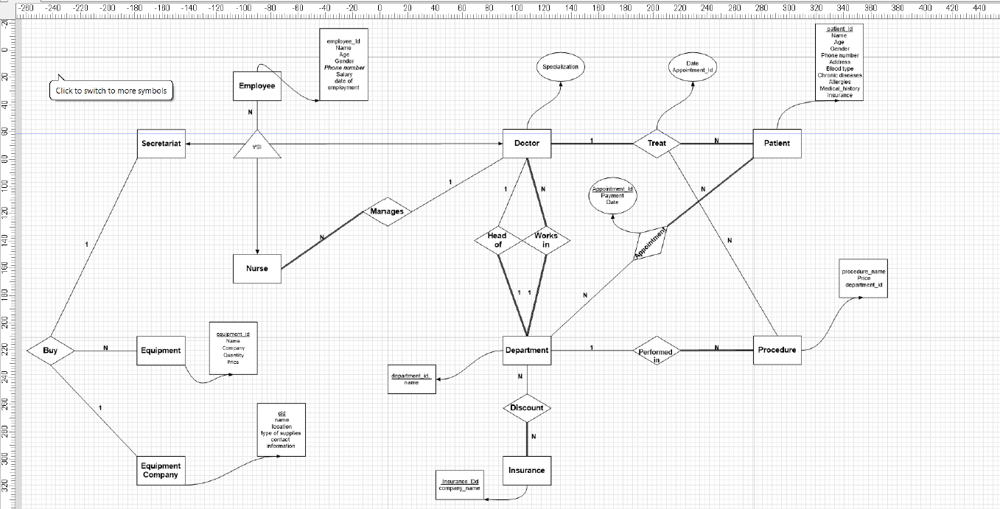
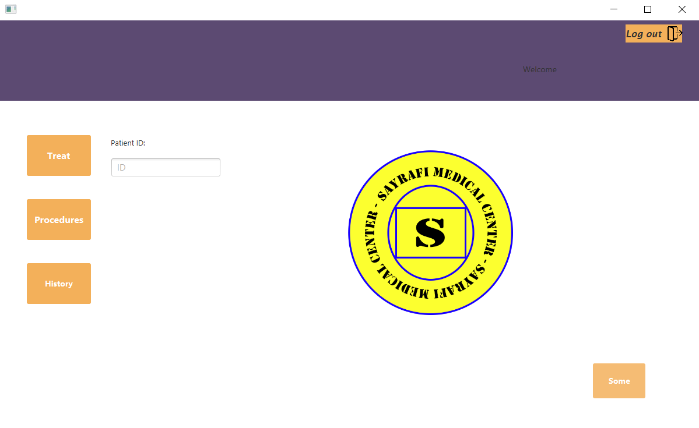
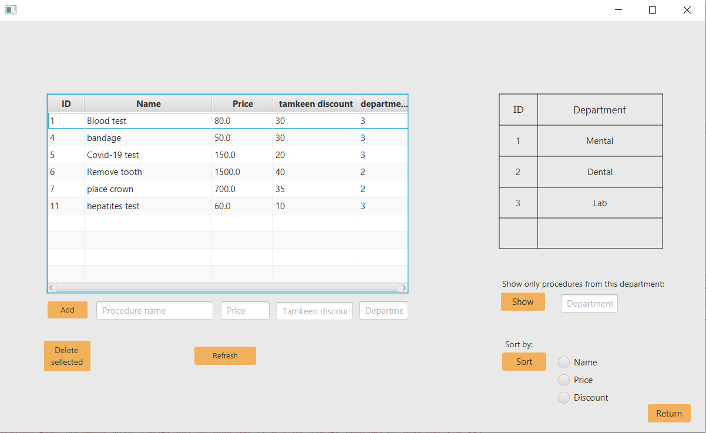
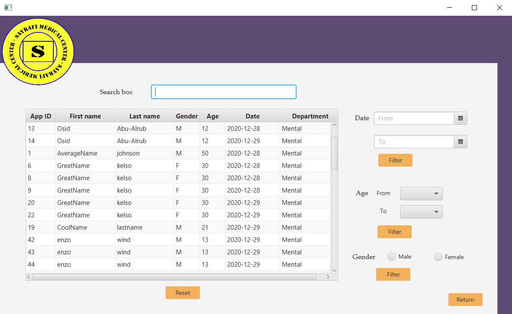

 <h1>Medical Center Management System</h1>
  
This project is a Java-based application that utilizes Scene Builder for the graphical user interface and MySQL for data storage. The system is designed to facilitate the management and organization of a medical center, providing features for patient records, appointment scheduling, and staff management.

  

  
  
  
  

